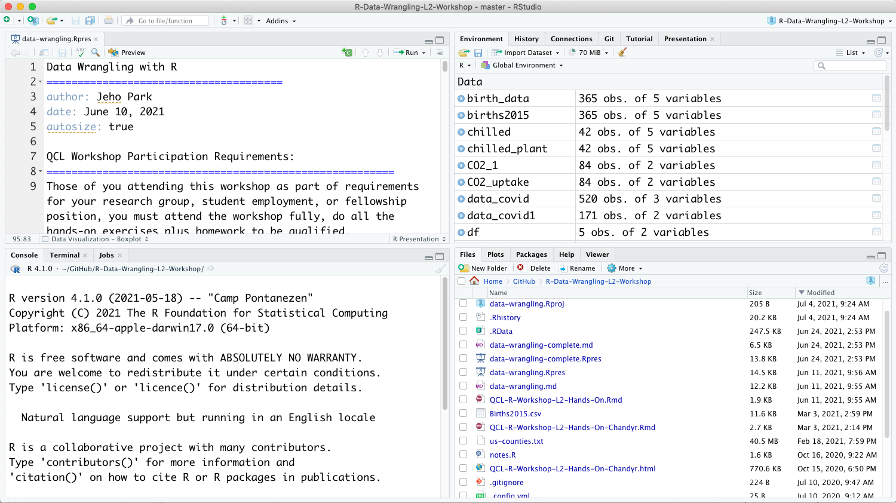

[Foundations of Data Science with Capstone at SMU, Summer 2021]
Introduction
========================================================
author: Dr. Jeho Park
date: 
autosize: true


Introduction: Instructor
========================================================
About Me


Introduction: TA
========================================================
About TA


Introduction: Students
========================================================


```r
# About YOU
```
__Open your camera and mic__

- Name
- Major and Year
- Recommend one of your favorite movies/books/TV shows/songs
- Recommend one of your favorite restaurants around SMU
- Your expectation from this course


Course Goal
========================================================

__After taking this course, you’ll be able to utilize the tools required to tackle a wide variety of data science challenges using R.__

Course Schedule
========================================================
| Day 	| Title                               	| Topics                                                                                 	|
|-----	|-------------------------------------	|----------------------------------------------------------------------------------------	|
| 1   	| Introduction                        	| Introduction to Data Science; RStudio; R Markdown                                      	|
| 2   	| Data Visualization (1)              	| Graphical grammars (ggplot2)                                                           	|
| 3   	| Data Visualization (2)              	| Visualization in the tidyverse; Aesthetic mappings                                     	|
| 4   	| Data Wrangling (1)                  	| R basics for data wrangling; Basic R objects and operators; Transforming data (filter) 	|
| 5   	| Data Wrangling (2)                  	| Transforming data (dplyr); filter, arrange, select, summarise, group_by; piping        	|
| 6   	| Exploratory Data Analysis and Stats 	| Why EDA; Some statistics; Variation; Covariation                                       	|
| 7   	| Working with different data types   	| Vectors; Factors; Strings; Dates and Times                                                      	|
| 8   	| Programming in R (1)                	| Pipes; Functions; Iteration and vectorization                                          	|
| 9   	| Programming in R (2)                	| Pipes; Functions; Iteration and vectorization                                          	|
| 10  	| Modeling                            	| Regression; Linear models; Understanding residual                                      	|

Week 3 (Day 11 through 15) is dedicated to capstone project.   
At the end of the week 3 (Day 15), we will have in-person meetings and final presentations.


Expectations
========================================================
1. __Our main communication language is English__  
    *You can selectively use Korean (as I can understand Korean well)*

1. __Participation is the key__  
    *Show your attention (camera, gestures, chat, voice, etc.).*
    
1. __Labs will be run by TAs__  
    *Due to Time Zone issue, instructor may not be able to answer your questions during your lab session. But he will answer any questions the next day (in Pacific Time)*

1. __For the first 1 to 1.5 hours of your lab session, you will not read the exercise solutions__
    *This is important for your learning. Do not directly refer to the solutions. You can google, look at the text book, ask questions, and discuss different approaches with your teammates. 

1. __During the first 2-week study, you will need to find a capstone project__  
    *Instructor and TA will help you on this*


Course Technologies
===================
- Google Drive (file sharing) 
  - Check if you can access the Google Drive Folder
- Kakaotalk (communication)
  - Join the 단톡방
- GitHub (course materials) https://github.com/CMC-QCL/FoDS_SMU
  - It is a private repo
  - Let me know your GitHub account name to add you to the repo

__How about Slack?__

Course Syllabus
========================================================
See if you can access this doc at

[Course Syllabus](https://drive.google.com/file/d/1QRZiAJOH_GQMtAW0_3HxbOnXARoSfobQ/view?usp=sharing)

Text Book
========================================================
[Main Text] __R for Data Science by Hadley Wickham and Garrett Grolemund__

- https://r4ds.had.co.nz/ (English Version)

- https://sulgik.github.io/r4ds/ (Korean Version) -- This might be outdated, so check its updates.

[Reference] 

1. __Foundations of Data Science by Mark Huber__  
  https://www.markhuberdatascience.org/data-science-text
   
2. __Hands-On Programming with R by Garrett Grolemund__  
  https://rstudio-education.github.io/hopr/

Introduction to Data Science
========================================================
__Today's Goals__

(1) Make sure everyone set the RStudio environment   
(2) Get familiar with RStudio environment  
(3) Create a first R markdown file  
(4) Solve exercise problems and add solutions to a markdown (Lab session)  

What is Data Science?  
=============

Data science consists of the methods and tools for collecting, manipulating, and studying data with a goal of making informed decisions.

[Breakout Session 1] Open Discussion
=================
- Team up!

- Discuss briefly about what the informed decisions might be in your domain/field (5 min)

- Share your team's example(s) in the main room (5 min)

Typical Data Science Project Workflow
===================
<br><div align="center">
  
</div>

R and RStudio
=============
<div align="center">
  
</div>

What is R?
========================================================
* R is a statistical programming language and environment.
* R is open source/free.
* R is widely used/preferred.
* R is cross-platform.
* R is hard to learn.

What is not R?
========================================================
* S: R's ancestor
* S-Plus: Commercial; modern implementation of S
* SAS: Commercial; widely used in the commercial analytics.
* SPSS: Commercial; easy to use; widely used in Social Science.
* MATLAB: Commercial; can do some Stats. 
* Python: Also can do some Stats; good in deep learning

Whic is better for Data Science? R or Python?
=============
R is Useful and easier to do __Statistical Modeling and Visualization__

---------

Python has a great collection of libraries to do __Machine learning and Deep Learning__

R Packages
========================================================
- R is known for its community and its huge collection of user-generated packages
- Packages are collections of R functions, data, and compiled code in a well-defined format. The directory where packages are stored is called the library.
- We will install the `tidyverse` package, a collection of R packages for data science


```r
install.packages('tidyverse') # you can also use RStudio's Packages tab

# You should load dplyr package first to use any functions and datasets in the package
library(tidyverse) 
```

What is RStudio?
========================================================
* Integrated Development Environment for R
* Nice combination of GUI and CLI
* Free and commercial version
* 4 main windows, tabs, etc
* Version control: Git and VPN
* Debugging 
* Documentation: R Markdown
  - install.packages("rmarkdown")
  - http://rmarkdown.rstudio.com/
* Presentation slides: R Presentation (this one!)


How to Get Help
========================================================
* Stack Overflow: http://stackoverflow.com/questions/tagged/r
* Cross-Validated: the statistics Q&A site http://stats.stackexchange.com/
* Google


[Breakout Session 2] Where to get help?
=============
- Find Korean websites/community that you can ask questions about R programming (5 min)
- Suggest them in the main room (5 min)


[Hands-On] Check Your R Environment 
========================

- Check R (if you don't have R, install it now)

- Check RStudio (if you don't have RStudio, install it now)

- Share your screen

[Hands-On] First R Project 
========================

- Create a new project named "FoDS+SMU"

Documentation: R Markdown 
========================
__R Markdown is our main documentation tool__

- Basic Formatting
  - Global options
  - Text formats
- R Code Chunks
  - Code chunk options
- R Markdown cheat sheet and quick reference
  - https://rmarkdown.rstudio.com/lesson-15.HTML

R Markdown Basic Formatting
======================

Open "Basic_formatting.Rmd"


[Hands-On] First R Markdown 
========================
__R Markdown__  

1. Create a new R Markdown (Rmd) file named "My First Rmd"
1. Check if you have knitr package (if not, install it)
1. Check R Markdown Cheatsheet
1. Check this website
https://ntaback.github.io/UofT_STA130/Rmarkdownforclassreports.html#what_is_markdown

[Hands-On] First R Markdown (cont.)
========================
__R Markdown__ 

Let's go over __Section 27.3__ Text Formatting.

- Copy and paste Section 27.3 code snippet into your Rmd file


[LAB1] R Markdown Exercise 
=================
As a team of 2, do all the exercise problems in the sections 27.3, 27.4:
- 27.3.1 Exercises
- 27.4.7 Exercises

(1) First create a new markdown and name it "FoDS+SMU LAB1"

(2) Include the exercise problems and your answers (in Korean!)

(3) By the end of today, submit your exercise file (.Rmd) through the student portal.

*At the end of your markdown, add one more section named "Questions" and include any questions that were not answered during the Lab session. I will try to review those questions and answer them tomorrow.*


