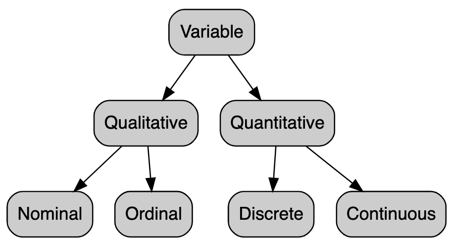

[Foundations of Data Science with Capstone at SMU, Summer 2021]
Day 3: Visualization (2)
========================================================
author: Dr. Jeho Park
date: 
autosize: true


DAY2 and LAB2 Review
========================================================

Any questions?

Today's Topics
==============
- Faceting by one variable
- Types of variables (in stats)
- Faceting by two variables
- Geometric Objects
- Mapping scope: Global vs. Local
- Statistical Transformations
- Visual Transformations

Faceting by a single variable
=========
__Use `facet_wrap`__

1. the first argument should be a *formula* and  

2. the variable that you pass to `facet_wrap` should be *discrete*.


```r
ggplot(data = mpg) + 
  aes(x = displ, y = hwy) + 
  geom_point() + 
  facet_wrap(~ class, nrow = 2)
# facet_wrap(. ~ class, nrow = 2) # same result
```

What is a R formula?
==================
A formula is an R object containing a symbolic representation of a relationship between variables. Formulas are not For example, **y ~ x + a** is a *formula* which we may read "`y` varies with `x` and `a` (note that the meaning depends on the function in which the formula is used). In most modeling cases, the left-hand side of a tilde (~) is the "dependent variable" (or "response") and the right-hand side is the "independent variable" (or "predictor"). 

Example: In a data frame, you have a variable `t` for temperature and another variable `m` for month. Clearly, month do not vary with temperature, but temperature varies with month. So, you want to see how the temperature varies for different month. How do you write a formula for this model?

What is a discrete variable?
===================


Source: https://statsandr.com/blog/variable-types-and-examples/

What is a discrete variable?
===================

>> Quantitative *discrete* variables are numeric variables for which the values it can take are __countable__ and have a __finite number of possibilities__. The values are usually, but not always, integers. For example:

>> - Number of children per family
>> - Number of students in a class
>> - Number of citizens of a country

Then, what is a continuous variable?
===================
>> Quantitative *continuous* variables are numerical measurements whose values are __not countable__ and have an __infinite number of possibilities__. For example:

>> - Age
>> - Weight
>> - Height

Q: Classify the following variables as continuous or discrete:
===============================================
(1) Temperature in Asan  

(2) The number of sales made in a week  

(3) Time taken to run a 100-meter dash   

(4) The quantity of fat in samgyupsal  

(5) The number of trout in Sinjungho  

Faceting by two variables
=========
To facet your plot on the combination of two variables, add facet_grid() to your plot call.


```r
ggplot(data = mpg) + 
  aes(x = displ, y = hwy) + 
  geom_point() + 
  facet_grid(. ~ class)
```

The differences between facet_wrap and facet_grid
================


- facet_grid() (left) is fundamentally 2d, being made up of two independent components. 
- facet_wrap() (right) is 1d, but wrapped into 2d to save space.

[Source: https://ggplot2-book.org/facet.html]

Geometric Objects (geom)
=======================
A __geom__ is the geometrical object that a plot uses to represent data. 

For example:  
- bar charts = bar geoms
- line charts = line geoms
- boxplots = boxplot geoms
- scatter plot = point geoms

>> There are over 40 geoms in ggplot2 package.

Geometric Objects (geom): Where to put aesthetic mapping?
=======================

```r
# Using point geom
ggplot(data = mpg) + 
  geom_point(mapping = aes(x = displ, y = hwy))
```


```r
# Using smooth geom
ggplot(data = mpg) + 
  geom_smooth(mapping = aes(x = displ, y = hwy))
```


```r
# We can display multiple geoms in one plot
ggplot(data = mpg) + 
  geom_point(mapping = aes(x = displ, y = hwy)) +
  geom_smooth(mapping = aes(x = displ, y = hwy))
```

Geometric Objects (geom): Where to put aesthetic mapping?
=======================

```r
# Using multiple geoms
ggplot(data = mpg, mapping = aes(x = displ, y = hwy)) + 
  geom_point() + 
  geom_smooth() 
```


```r
ggplot(data = mpg) + 
  aes(x = displ, y = hwy) + 
  geom_point() + # Add mapping = aes(color = class) and see the difference
  geom_smooth() 
```

Mapping Scope: Global and Local
==========================
Global mapping: the mappings of variables done when the `ggplot()` is called
Local mapping: the mappings of variables done when the geom layer is called

>> Local mapping in a layer overrides the global mapping for that layer.


```r
# library(dplyr) # to use `filter` function below

ggplot(data = mpg) + 
  aes(x = displ, y = hwy) + 
  geom_point(mapping = aes(color = class)) + # use the global mapping
  geom_smooth(data = filter(mpg, class == "subcompact"), se = FALSE) 
```

Grammar of Graphics
=====================
Defines a plot as the combination of

1. __Data__
2. __Aesthetic Mapping__
3. __Geometric Object (representation)__
4. Statistical Transformation
5. Position Adjustment

Statistical Transformations (1) | Breakout Session
==================
Let's take a look at the `diamonds` dataset included in the `ggplot2` package.

In your team, discuss the following:

>> Q1: What are the variables in the `diamonds` data frame?

>> Q2: Which variables are quantitative and which are qualitative?

>> Q3: Which variables are quantitative discrete and which are quantitative continous?

>> Q4: What are some visualizations you want to create? (Come up with at least one)

Statistical Transformations (2)
==================
### Some plots visualize a transformation of the original data set. 

Look at the following two plots and find the one that has a transformation variable in the result.


```r
ggplot(data = diamonds) + 
  aes(x = price, y = carat) +
  geom_point()
```


```r
ggplot(data = diamonds) + 
  aes(x = price) +
  geom_histogram()
```

Statistical Transformations (3)
==================
>- bar charts, histograms, and frequency polygons bin your data and then plot bin counts, the number of points that fall in each bin.

>- smoothers fit a model to your data and then plot predictions from the model.

>- boxplots compute a robust summary of the distribution and then display a specially formatted box.

Statistical Transformations (4): Boxplots
==================

```r
ggplot(data = mpg, mapping = aes(x = class, y = hwy)) + 
  geom_boxplot()
```


Visual Transformations (= Position Adjustments)
================
To add clarification or to show additional information on one plot, we can use position adjustment methods in ggplot2.

(1) To avoid overlapping of points:


```r
ggplot(data = mpg) + 
  aes(x = displ, y = hwy) + 
  geom_point()
#  geom_point(position = "jitter")
```

Visual Transformations (2) Demo
================
(2) To show additional information through visual representation

- Barcharts
  - Simple barcharts
  - Colored barcharts
  - Stacked barcharts
  - Side-by-side barcharts


```r
ggplot(data = diamonds) + 
  geom_bar(mapping = aes(x = cut, fill = cut))
```


```r
ggplot(data = diamonds) + 
  geom_bar(mapping = aes(x = cut, fill = clarity))
```


```r
ggplot(data = diamonds) + 
  geom_bar(mapping = aes(x = cut, fill = clarity), position = "fill")
```


```r
ggplot(data = diamonds) + 
  geom_bar(mapping = aes(x = cut, fill = clarity), position = "dodge")
```


LAB3
=============
- 3.5.1: Do all the problems except #1
- 3.6.1: Do all the problems
- 3.7.1: These exercise problems are a bit more challenging than the previous ones. Try to understand the solutions rather than actually coding the solutions. Including these exercise is optional and will be entitled to extra credit.
- 3.8.1: Do all the problems


